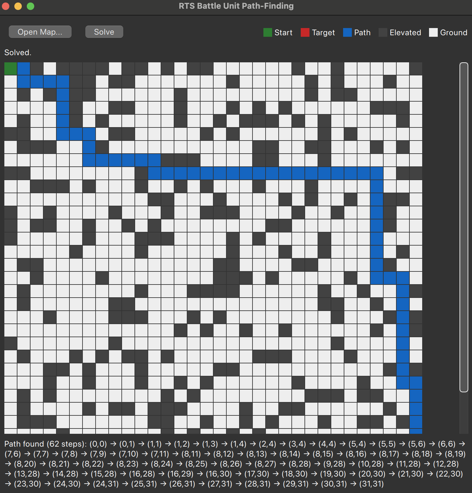
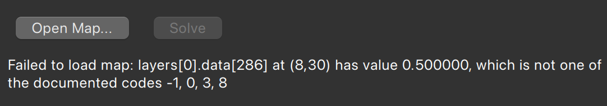
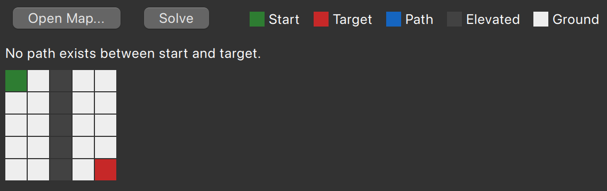
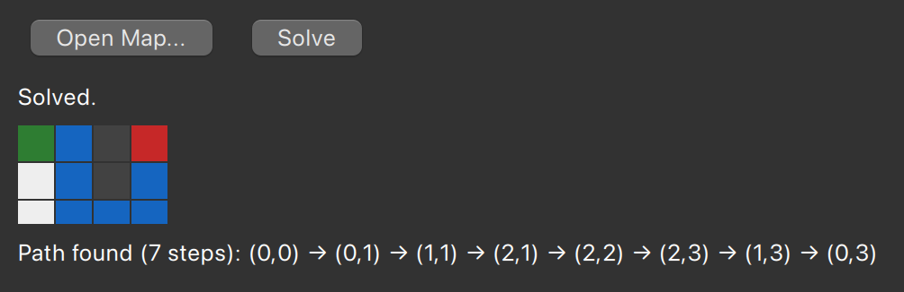

# RTS Battle Unit Path-Finding

[](https://github.com/xvallspl/rts-pathfinder/actions/workflows/ci.yml)

Software Candidate Assessment take-home project: path-finding for battle units on a
grid-based battlefield, with a C++23 core and a Qt Quick (QML) user interface.

The badge covers the core library and its test suite on macOS (Apple Clang) and Windows
(MSVC), built without Qt — the UI is verified locally (see [Sample Runs](#sample-runs)).

See [Design Decisions](#design-decisions) for a log of the choices made and the
reasoning behind them — each entry was written at the moment the decision was made,
not reconstructed afterward.

## Table of Contents

- [Project Structure](#project-structure)
- [Build Instructions](#build-instructions)
- [Design Decisions](#design-decisions)
- [Third-Party Libraries](#third-party-libraries)
- [Sample Runs](#sample-runs)
- [AI Usage](#ai-usage)
- [Feedback on the Assessment](#feedback-on-the-assessment)

## Project Structure

```
rts-pathfinder/
├── CMakeLists.txt           # top-level build; RTS_BUILD_TESTS, RTS_BUILD_UI options
├── core/                    # C++23 static library, no Qt dependency
│   ├── include/rts/
│   │   ├── battlefield.hpp  # Position, Terrain, Battlefield grid, neighbors4()
│   │   ├── pathfinder.hpp   # findPathBfs()
│   │   └── tilemap_json.hpp # TilemapDocument (RiskyLab JSON parsing), MapError
│   └── src/                 # implementations
├── ui/                      # Qt Quick (QML) application — the sole interaction surface
│   ├── src/                 # MapModel, SolverController (the C++/QML bridge)
│   └── qml/Main.qml
├── tests/                   # doctest, one file per core module
├── third_party/             # vendored: nlohmann/json, doctest
└── samples/                 # four sample maps — see Sample Runs
```

## Build Instructions

Prerequisites: CMake ≥ 3.21 and a C++23 compiler (built with Apple Clang 17). Qt 6.5+
(Core, Gui, Qml, Quick, QuickControls2, QuickDialogs2, QuickLayouts) is needed for the UI
only — the core library and tests build and run with no Qt installed at all.

**Core + tests only:**

```sh
cmake -B build -DRTS_BUILD_UI=OFF
cmake --build build
ctest --test-dir build --output-on-failure
```

**Everything, including the UI:**

```sh
cmake -B build -DCMAKE_PREFIX_PATH=<path-to-qt>
cmake --build build
./build/ui/rts_ui
```

`<path-to-qt>` is the Qt installation root — on macOS, e.g. `/opt/homebrew/opt/qt`
(Homebrew) or `~/Qt/6.x.x/macos` (official installer). If Qt can't be found, the build
prints a status message and continues without the `ui` target rather than failing.

## Design Decisions

### AI assistance

As a senior developer, I chose to build this project with AI assistance: I gave the
model an initial BFS-based approach and my preferences on structure, tooling, and
conventions, then evaluated and refined its suggestions from there. We worked out an
execution plan together; the AI handled most of the implementation, and I reviewed every
change before committing it.

### C++23, not C++17

The task document requires "C++17 or later"; this project targets **C++23**. CI is pinned
to toolchains recent enough to support it.

### Compiler warnings: on, not fatal

`-Wall -Wextra` / `/W4` are enabled but not treated as errors, so a newer reviewer
toolchain surfacing an unseen warning can't break the build.

### Path-finding: BFS

Every step on the map costs the same, so breadth-first search is a natural fit: it
explores outward from the start one ring at a time, which guarantees that the first time
it reaches the target it has found a shortest route. Dead ends need no special handling —
the "backtracking" the task requires — because the search simply continues from the other
open branches when one gets stuck (`samples/backtracking_maze.json` demonstrates this).
A depth-first backtracking search was rejected: it finds *a* path, but not necessarily a
short one. A* would visit fewer cells along the way, but on a 32×32 map the difference is
negligible and it needs more machinery; it is the natural upgrade if maps grow much larger.

### Multi-unit: a conquer model

The optional extra task asks for several units moving simultaneously. The task document
describes the situation but not the rules of engagement, so this implementation treats it
as a conquer game: units claim targets, and the run ends the moment every target is held.

`findPathsBfs` returns one path per unit, all of the same length, with the index being the
tick — so `paths[u][t]` is where unit `u` stands at tick `t`, and the set together is a
frame-by-frame recording that the UI replays a second at a time. A cell repeated on
consecutive ticks means that unit held position.

The rules the task document leaves open, and what was chosen for each:

- **Waiting is a legal move.** Without it a unit could never step aside to let another
  pass, and on a 4-connected grid a unit forced to move every tick can only ever reach a
  given cell on ticks of one parity — which makes some otherwise solvable situations
  impossible.
- **Two units may swap places.** The document's only stated constraint is that a position
  holds at most one unit at any moment, and units exchanging cells never share one.
  Forbidding it would be a rule of my own invention, so it is allowed.
- **Targets are claimed nearest-first.** One search per target measures the true walking
  distance — around elevated terrain, not through it — from that target to every unit.
  The closest (unit, target) pair is claimed, then the next, until every target has an
  owner. Nothing in the map format says which unit belongs to which target, so an
  arbitrary pairing would have been indefensible.
- **Units left over stay home.** With more units than targets, the unclaimed ones hold
  their starting cell for the whole run and count as obstacles for everyone else.
- **Arrival is permanent.** A unit that reaches its target stays on it; units planned
  afterwards route around it.
- **The input needs at least as many units as targets**, and at least one of each.
  Anything else is rejected with a message rather than guessed at.

Two limitations are worth stating plainly. Routes are planned one unit at a time against
the ticks already reserved by the others, which is what keeps the problem tractable —
planning every unit simultaneously is NP-hard. The price is that an unlucky order can fail
on a map where some cleverer coordination exists; the program says so rather than
pretending. For the same reason the claim distances ignore congestion, so "closest" is
measured on an empty battlefield: a unit that ends up queueing behind another may arrive
later than its distance suggested.

### Tile values: exactly the four documented codes, nothing else

The task document defines exactly four values: `-1` ground, `0` start, `8` target, `3`
elevated. A value outside that set — including a non-integer one — is not a variant of a
documented code, it's outside the format; the parser throws `MapError` naming the
offending cell rather than guessing at undocumented meaning.

The sample map provided doesn't conform to this: it has no plain `8`, and
carries `0.5`/`8.1` instead of documented codes. Rather than build tolerance into the
parser to make that one file happen to parse, `samples/interviewer_sample.json` is kept
as a negative test — proof the parser rejects it cleanly, with a clear, specific error —
and a separate, spec-conformant `samples/sample_map.json` (generated, guaranteed
solvable) is used everywhere a positive example is needed.

### Map dimensions: derived, not assumed

The sample JSON has no `tileswide`/`tileshigh` fields (unlike typical RiskyLab exports).
Dimensions are resolved as: explicit `tileswide`/`tileshigh` if present, else
`canvas.width / tilesets[0].tilewidth` (and the equivalent for height), else a `MapError`.

### UI: Minimal solving UI

Load a map, solve, view the result — no in-app editing, export, or random-map controls.
The grid renders as flat colored cells rather than RiskyLab's actual tileset: that site
publishes no license for its tile images (a real redistribution risk in a public repo),
and separately, its tileset renders a plain `0`/`8` as a fully transparent tile, which
would make our own start/target invisible if used as-is.

## Third-Party Libraries

- **nlohmann/json 3.11.3** (MIT) — JSON parsing for the RiskyLab tilemap format.
  Vendored as a single header in `third_party/nlohmann/`. A hand-rolled parser was
  considered, since only a few fields are actually read; rejected because JSON's grammar
  (string escaping, number formats) is easy to get subtly wrong, and skipping correctly
  past the parts we don't care about still requires parsing them correctly.
- **doctest 2.4.11** (MIT) — unit testing. Vendored as a single header in
  `third_party/doctest/`. Chosen over Catch2/GoogleTest for compile speed and
  zero-dependency, single-header integration.

## Sample Runs

### `samples/sample_map.json` — solved

32×32, start `(0,0)`, target `(31,31)`. `findPathBfs` finds a 62-step path (63
positions), and the UI highlights it on the grid while showing the same list as text:

```
(0,0) -> (0,1) -> (1,1) -> (1,2) -> (1,3) -> (1,4) -> (2,4) -> (3,4) -> (4,4) -> (5,4) ->
(5,5) -> (5,6) -> (6,6) -> (7,6) -> (7,7) -> (7,8) -> (7,9) -> (7,10) -> (7,11) -> (8,11) ->
(8,12) -> (8,13) -> (8,14) -> (8,15) -> (8,16) -> (8,17) -> (8,18) -> (8,19) -> (8,20) ->
(8,21) -> (8,22) -> (8,23) -> (8,24) -> (8,25) -> (8,26) -> (8,27) -> (8,28) -> (9,28) ->
(10,28) -> (11,28) -> (12,28) -> (13,28) -> (14,28) -> (15,28) -> (16,28) -> (16,29) ->
(16,30) -> (17,30) -> (18,30) -> (19,30) -> (20,30) -> (21,30) -> (22,30) -> (23,30) ->
(24,30) -> (24,31) -> (25,31) -> (26,31) -> (27,31) -> (28,31) -> (29,31) -> (30,31) -> (31,31)
```



### `samples/interviewer_sample.json` — rejected

Loading this map fails with:

```
layers[0].data[286] at (8,30) has value 0.500000, which is not one of the
documented codes -1, 0, 3, 8
```

surfaced in the UI as a status message rather than a crash. See
[Design Decisions](#design-decisions) for why this map doesn't conform and is kept as a
negative test rather than something the parser is bent to accept.



### `samples/no_path_map.json` — no path exists

5×5, start `(0,0)`, target `(4,4)`, with a solid elevated wall down column 2 fully
separating them — valid input, but algorithmically unsolvable. `findPathBfs` returns
`std::nullopt`, and the UI reports "No path exists between start and target" rather than
showing a stale or empty grid.



### `samples/backtracking_maze.json` — dead-end recovery

The exact 3×4 maze from `test_pathfinder.cpp`'s `"finds a path around a wall, recovering
from the dead end it creates"` test, packaged as a map so the same scenario the test
suite verifies is also visually demonstrable. Start `(0,0)`, target `(0,3)`, a two-cell
wall directly blocks the straight route:

```
(0,0) -> (0,1) -> (1,1) -> (2,1) -> (2,2) -> (2,3) -> (1,3) -> (0,3)
```

7 steps (8 positions) — BFS's frontier detours around the wall via row 2 without any
explicit backtracking logic, which is what the task document's "must be capable of
backtracking" requirement is checking for. Small enough to visually verify the path is
genuinely shortest at a glance, unlike the 32×32 case above.



## AI Usage

This project was built with Claude Code as a pair-programmer, under direct supervision:
every design decision was proposed, discussed, and often revised before being adopted,
and every code change was reviewed — and editable — before being committed. That review
caught and reversed several planning-phase misconceptions and overreaches that would
otherwise have cost hours of development time, along with a number of misdirections,
bugs, and departures from agreed conventions during implementation.

The AI also structured and drafted parts of this document, and completed and reworded some
of my own text.

## Feedback on the Assessment

My first consideration was the time budget. I had read the project description and
experimented with the tilemap format a few days in advance, so I had already settled on an
algorithm and a rough shape for the project before starting work or involving the AI.

I ran into problems with the state of my existing setup: an old Qt installation that links
against a macOS graphics framework the current SDK no longer ships, which took some
debugging and an upgrade to resolve. I also couldn't work in one long focused block — it
was more a series of shorter, per-commit sessions. As far as I can tell the total was
within the suggested budget, though on the high side. Most of that time went to discussing
and correcting the AI's execution plans, steering it, and reviewing its code.

It was an enjoyable task, and I could easily have spent longer refining it — I can see how
it would be easy to get lost in it.

A few things I ran into regarding the task definition:

- The sample map doesn't follow the format the task specifies: it contains `0.5` and `8.1`.
  Importing it by hand did render something close to what the description implies, but I
  chose to stick to the documented format — even though a conforming map draws nothing for
  the unit and the target in that tileset.

- I couldn't find a source repository for the tilemap editor (the link is a 404), so I
  couldn't determine the license covering its assets. I had planned to map the woodland
  sprites onto our format, but decided against it: I couldn't confirm I was allowed to
  reuse them, and it was an extra rather than a requirement.

- The QML UI requirement came by email rather than in the task document. Being more of a
  backend person, I kept it as minimal as I could — the objective is to find a path on a
  valid map, and that is what the UI supports. I added a play-by-play replay for the
  multi-unit extra task and chose to use it for the single-unit case too: one presentation
  to learn instead of two, at the cost of showing a single path more slowly than simply
  drawing it at once.

- Platforms weren't specified. I assumed macOS, which I developed on, and Windows, which I
  covered through GitHub CI since I don't have access to a machine.

- Also not specified: I limited Qt and QML usage to modules available under the LGPL.

On the extra task:

- I went slightly over the time budget, but happily.
- I enjoyed weighing up the different ways it could be solved as stated, and deciding
  which constraints to add to such an open prompt — see the design decisions for the
  multi-unit model.
- Working on the UI in Qt Creator would have been faster and given a better result.
  Lesson learned.

